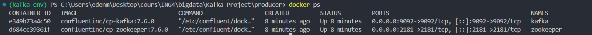
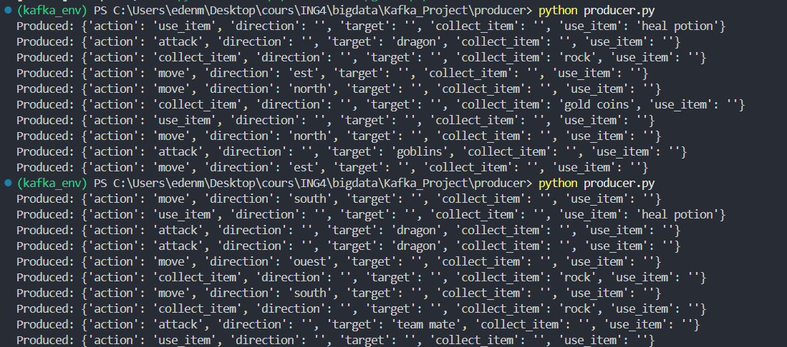
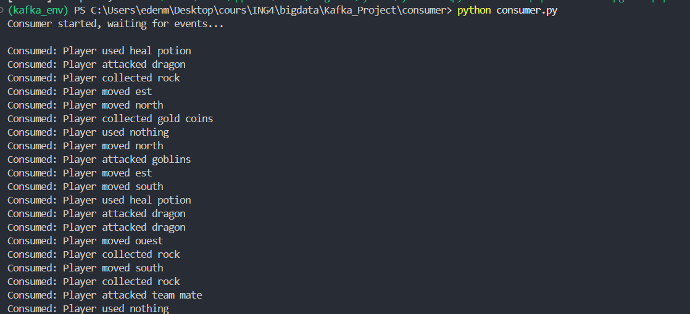

# Kafka_Project

Final Project : Technical Project (option A)

Big Data tool : Kafka 

The aim of this project is to reproduce real-time data flows in a video game. A producer will create an action, which will be processed by the broker(s), then the consumer will display the action.

## Why Kafka?

We chose Kafka because it's one of the most used tools for real-time data streaming, and it fits perfectly with our video game scenario. In a multiplayer game, you need to handle tons of player actions (movements, attacks, item pickups...) happening at the same time, and Kafka is built exactly for that kind of high-throughput, low-latency messaging.

Also, Kafka is widely used in the industry (Netflix, Uber, LinkedIn...) so it seemed like a good skill to learn for our future careers.

## How Kafka Fits in a Big Data Ecosystem

Kafka acts as a **central nervous system** for data pipelines. Here's how it connects with other Big Data tools:

```
[Data Sources]  →  [Kafka]  →  [Processing/Storage]
   (games,          (broker)      (Spark, Hadoop,
    sensors,                        databases...)
    apps...)
```

- **Ingestion**: Kafka collects data from multiple producers (in our case, player actions)
- **Buffering**: It stores messages temporarily, so consumers don't need to be online 24/7
- **Distribution**: Multiple consumers can read the same data (e.g., one for analytics, one for live display)
- **Integration**: Kafka Connect can pipe data to HDFS, Elasticsearch, databases, etc.

In a real game infrastructure, Kafka could feed player actions to:
- A **Spark Streaming** job for real-time analytics (cheating detection, live stats)
- A **database** for persistence (game history)
- A **notification service** for alerts 

## Structure 
```
kafka_project/
│
├── consumer/
│   ├── consumer.py
│   └── requirements.txt
│
├── data/
│   └── actions.json
│
├── producer/
│   ├── producer.py
│   └── requirements.txt
│
├── screenshots/
│   ├── kafka-running.png
│   ├── producer-output.png
│   └── consumer-output.png
│
├── docker-compose.yaml
└── README.md
```

## Installation 
1. Clone project 
```bash
git clone https://github.com/JadePlanECE/Kafka_Project.git
```

2. Create virtual environnement (recommanded) 
```bash
python -m venv kafka__env

# Windows 
kafka_env\Scripts\activate 
# Linux 
source kafka_env/bin/activate
```

3. Install dependencies 
```bash
pip install -r requirements.txt
```

## Running 
1. Run Kafka tool
```bash
docker-compose up -d
docker ps # check if container started 
```

2. Run producer 
```bash
cd producer
pip install -r requirements.txt
python producer.py
```

3. Run consumer
```bash
cd consumer
pip install -r requirements.txt
python consumer.py
```

## Screenshots

### Docker containers running


### Producer output


### Consumer output



## Authors 
- [Jade Planterose](https://github.com/JadePlanECE)
- [Eden Masmoudi](https://github.com/edenmsd)
